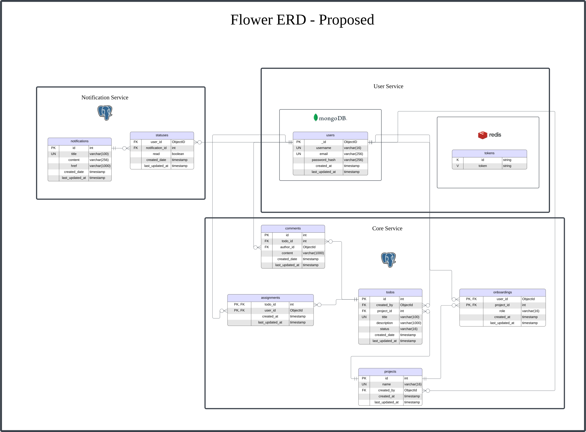

# Data Models

## Current Implementation

### Diagram

The entity-relationship diagram (ERD) for the current implementation of Flower is as follows:

### Explaining the Data Models

As mentioned in the [previous section](./databases.md), the current implementation of Flower uses a single PostgreSQL database to store all data.

The data models used in the current implementation are as follows:

1. Users
   - The user model stores the following attributes:
     1. `id`: This is the primary key for the user table. It is an auto-incrementing integer.
     2. `username`: This is the username selected by the user. It is unique, in order to prevent confusion on the client-side.
     3. `password_hash`: This is a hashed password. We store a hash instead of the actual password to prevent the password from being exposed in the database.
     4. `role`: This is the role of the user. It can be either `admin` or `user`.
     5. `created_at`: This is the date and time when the user was created. It is auto-generated by the database.
     6. `updated_at`: This is the date and time when the user was last updated. It is auto-generated by the database.
2. Sessions
   - The session model stores the following attributes:
     1. `id`: This is the primary key for the session table. It is an auto-incrementing integer.
     2. `token`: This is a JWT generated upon user authentication. It is unique by nature, so a unique constraint is added.
     3. `user`: This is a foreign key that references the `id` column in the user table.
     4. `created_at`: This is the date and time when the user was created. It is auto-generated by the database.
     5. `updated_at`: This is the date and time when the user was last updated. It is auto-generated by the database.
3. Projects
   - The project model stores the following attributes:
     1. `id`: This is the primary key for the project table. It is an auto-incrementing integer.
     2. `name`: This is the name of the project. It is unique, in order to prevent confusion on the client-side.
     3. `created_at`: This is the date and time when the user was created. It is auto-generated by the database.
     4. `updated_at`: This is the date and time when the user was last updated. It is auto-generated by the database.
4. Onboardings
   - The onboardings model is a bridging model that captures user assignments to projects. It stores the following attributes:
     1. `project`: This is a foreign key that references the `id` column in the project table.
     2. `user`: This is a foreign key that references the `id` column in the user table.
     3. `created_at`: This is the date and time when the user was created. It is auto-generated by the database.
     4. `updated_at`: This is the date and time when the user was last updated. It is auto-generated by the database.
5. Todos
   - The todo model is used to encapsulate the details of a task. It stores the following attributes:
     1. `id`: This is the primary key for the todo table. It is an auto-incrementing integer.
     2. `project`: This is a foreign key that references the `id` column in the project table.
     3. `created_by`: This is a foreign key that references the `id` column in the user table. It references the user who created the task.
     4. `assignee`: This is a foreign key that references the `id` column in the user table. It references the user who is responsible for the task.
     5. `title`: This is the name of the task. It is unique, in order to prevent confusion on the client-side.
     6. `description`: This is a description of the task.
     7. `status`: This is the status of the task. It can be either `to_do`, `in_progress`, or `completed`.
     8. `created_at`: This is the date and time when the user was created. It is auto-generated by the database.
     9. `updated_at`: This is the date and time when the user was last updated. It is auto-generated by the database.
6. Comments
   - The comment model is used to encapsulate the details of a comments made under a task. It stores the following attributes:
     1. `id`: This is the primary key for the comment table. It is an auto-incrementing integer.
     2. `todo`: This is a foreign key that references the `id` column in the todo table.
     3. `author`: This is a foreign key that references the `id` column in the user table. It references the user who made the comment.
     4. `content`: This is the content of the comment.
     5. `created_at`: This is the date and time when the user was created. It is auto-generated by the database.
     6. `updated_at`: This is the date and time when the user was last updated. It is auto-generated by the database.

## Proposed Implementation

### Diagram

The entity-relationship diagram (ERD) for the current implementation of Flower is as follows:

You can [view the diagram in a new tab](./img/flower-erd.svg) to zoom in to see the details.

### Explaining the Data Models

#### User Service

The user service has a [MongoDB](https://www.mongodb.com/) database with a single collection called `users`. The attributes of the collection are as follows:

1. `uuid`: This is the primary key for the user collection. It is a UUID.
2. `username`: This is the username selected by the user. It is unique, in order to prevent confusion on the client-side.
3. `password_hash`: This is a hashed password. We store a hash instead of the actual password to prevent the password from being exposed in the database.
4. `created_at`: This is the date and time the user was created. This is auto-generated during insertion.
5. `updated_at`: This is the date and time the user was last updated. This is auto-generated during insertion.

Notice that unlike the current implementation, we do not store the role in the user table. This is for **two reasons**:

1. We want keep the user service independently deployable and decoupled from the other services. The role information is particular to Flower, and thus we handle roles as part of the `onboardings` table in the `core` service.
2. We want users to users to be able to have different roles in different projects, so it makes more sense to store the role information in the `onboardings` table of the `core` service.

The user service also has a [Redis](https://redis.io/) cache that contains key-value pairs related to user tokens (JWTs).
