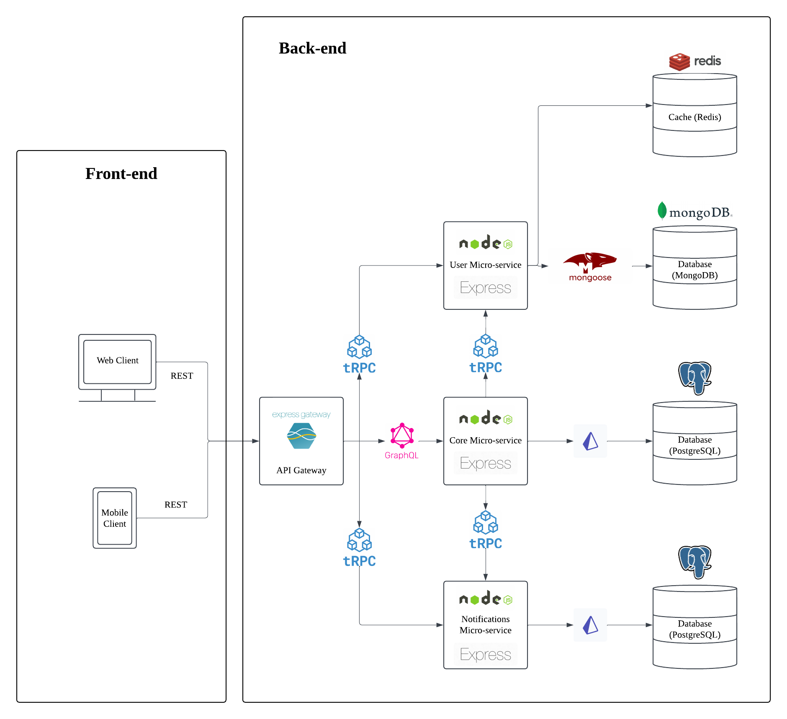

# Architecture Diagram

This page contains the current architecture diagram of Flower's backend, as well as a diagram of a proposed future architecture.

## Current Implementation

The current implementation of Flower's backend is a monolithic application written in [Node.js](https://nodejs.org/en/) and [JavaScript](https://developer.mozilla.org/en-US/docs/Web/JavaScript).

### Diagram

The following diagram shows the current architecture of Flower's backend:

### Explaining the Architecture

lorem ipsum

### Pros and Cons

The pros of the current implementation are:

- The architecture is simple and easy to understand, making it easy to onboard new developers.
- The architecture can be developed quickly by a solo developer or small team of developers.
- There are fewer technologies to learn, which is less overwhelming for new developers.

Due to the current implementation being monolithic, it has a few cons:

- Different areas of functionality are not independently scalable, which can lead to performance issues.
- The architecture is not modular, which can make it difficult to develop new features or fix bugs.
- Since the application is not modular, developers cannot specialise in certain areas of functionality, which can lead to duplication of effort.

## Proposed Implementation

The proposed implementation of Flower's backend is a microservices architecture, with each service being responsible for a specific function.

### Diagram

The following diagram shows the proposed architecture of Flower's backend:

### Explaining the Architecture

lorem ipsum

### Why the proposed implementation?

The pros of the proposed implementation are:

- The architecture is modular, which makes it easier to develop new features or fix bugs.
- The architecture is scalable, as each service can be developed independently and scaled as needed.
- The architecture is easier to deliver in an efficient manner, as each service can be developed by a small, specialised team of developers.

Due to the proposed implementation being microservices, it has a few cons:

- The architecture is more complex than the current implementation, which can make it harder to understand.
- The architecture is more difficult to develop quickly, as it requires more planning and coordination.
- There are more technologies to learn, which can be overwhelming for new developers.

## Conclusion

